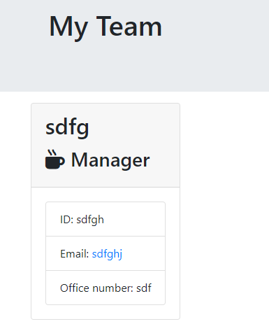

# Employee Template Generator

  
## Contributors
@sammiefrog
    
## Table of Contents
<li><a href="#description">Description</a></li>  
<li><a href="#installation">Installation</a></li> 
<li><a href="#tech">Technology Stack</a></li> 
<li><a href="#usage">Usage</a></li> 
<li><a href="#contact">Contact</a></li> 
<li><a href="#screenshots">Screenshots</a></li> 
<li><a href="#tests">Tests</a></li> 
  
<h2 id= "description">Description</h2>
This is a command-line application to generate an html page of a work team. 
  
<h2 id= "installation">Installation</h2>
Fork this repo, clone it to your machine, npm i, run node app.js
    
<h2 id= "technology">Technology Stack</h2>
 Node.Js, JavaScript, GIT, GitHub, Command- Line
  
<h2 id= "usage">Usage</h2>
Use is to build an HTML page displaying all members of a work team.

<h2 id= "contact">Contact</h2>
<li>Name: Sammantha Sasenick</li> 
<li>Github: https://github.com/sammiefrog</li> 
<li>Portfolio: sammiefrog.github.io</li>
<li>Email: <a href="mailto:ssasenick412@gmail.com" target="_blank">ssasenick412@gmail.com</a></li> 
<li>LinkedIn: www.linkedin.com/in/sammantha-sasenick412</li> 

<h2 id= "screenshots">Screenshots</h2>

    
<h2 id= "tests">Tests</h2>
 